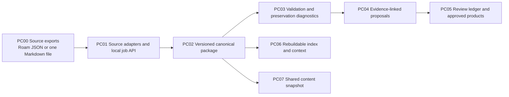

# PKM Canon architecture: current state

**Evidence base:** the [PKM Canon tests](../../tests/) and repository checks, verified 2026-10-03. These components are implemented in this repository. The [component map](component-map.md) names code, checks, work items, and decisions.

The package is the authoritative **source-fidelity** result. A validated package does not approve claims found in its content. The review ledger governs methodology or domain-page proposals separately. Indexes, audit Markdown, and context bundles are derived from the package. `PC07` exports a versioned, source-neutral contract; the synthetic CanonFlow consumer checks its references without importing this runtime.

The local job API binds to loopback, stores resumable job state in SQLite, and delegates package creation to a worker. It is not a hosted authenticated service. Roam support is bounded to the recorded source profile and diagnostics; the current methodology queue is calibrated for the representative graph, not an automatic policy for every future source.
