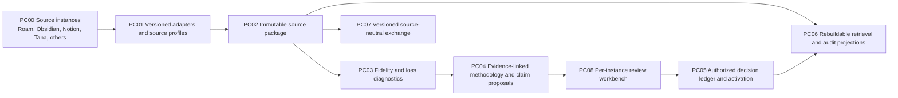

# PKM Canon architecture: target state

**Status:** proposed direction, not implemented end to end. [Current implementation](current-state.md) and the [component map](component-map.md) identify what exists. The target preserves product-owned authority and keeps indexes rebuildable.

`PC08` combines automated source-instance observations with human approval or rejection of proposed methodology. A source-type profile supplies defaults, while each import records its own scope, evidence, diagnostics, decisions, and versioned active manifest. Approval of a methodology rule does not endorse every assertion in the source. Adding adapters must not weaken package validation or silently discard native structure.

`PC07` remains a contract boundary to other products. Shared schemas and synthetic fixtures are the interoperability gate; a shared runtime package waits until two products need the same executable behavior. Source access and authority filters precede relevance ranking, and historical source refs remain auditable.
