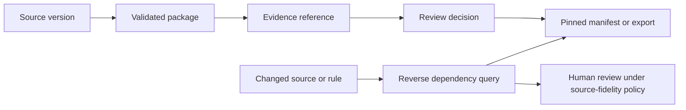

# Provenance, lineage, and ripple in PKM Canon

**Status:** Proposed contract. PKM Canon already records source versions, hashes,
evidence references, and package IDs; a durable version-level dependency
ledger and reverse-impact service are not implemented yet.

**Portfolio decision:** [Named canons](https://app.notion.com/p/3ea899c28af38140907bd5c4a34a059d)
and [provenance, lineage, and ripple](https://app.notion.com/p/3ea899c28af381d8a16ffe236e8d5a93)
in Canonworks.

## Shared decision

**Provenance** records an object's origin, transformation, and responsible
actors. **Lineage** records durable dependencies between versions, runs, and
outputs. **Ripple** traverses those dependencies backward from a change,
compares the relevant snapshots, and asks the product's policy what needs
review.

These are three views of related evidence, not interchangeable names. The
[portable canon contracts](canon-contracts-v0.1.md) define version references,
snapshots, publication pins, dependency edges, and impact queries that can be
shared without imposing PKM Canon's package format on another product.

## PKM Canon application

- **Provenance:** identify the source system, source scope/native ID, captured
  bytes and hash, parser/profile version, transformation activity, and actor or
  service responsible for each package. A faithful package records what its
  source said; it does not endorse the statement.
- **Lineage:** record exact `SourceVersion → package record → EvidenceRef →
  proposal/review decision → methodology manifest or export` dependencies.
  Rebuildable search indexes and projections identify the package and build
  run that produced them. The edge points from input to dependent, with a
  typed relation and evidence.
- **Ripple:** when a source version, parser rule, or approved methodology rule
  changes, traverse dependent records and outputs in reverse; compare their
  pinned source/package snapshot and actual evidence refs with the proposed
  state. Report an explained review candidate, not an automatic correction.
  A package that merely contains a changed node is a broader, lower-confidence
  match than an output that actually cited that node.

## Standards and storage boundary

[W3C PROV-O](https://www.w3.org/TR/prov-o/) supplies interoperable vocabulary
for entities, activities, agents, use, generation, and derivation. PKM Canon can
map a source version or package to an Entity, parsing to an Activity, and the
operator or parser service to an Agent, while retaining its own product IDs.

[OpenLineage's job/run/dataset model](https://openlineage.io/docs/spec/object-model/)
can describe ingestion and index-build runs, input/output datasets, and
dataset versions. Emit it from durable events when an operational lineage
backend is useful. PKM Canon still needs exact record/evidence dependencies for
questions such as “Which approved rule cited this changed node?” OpenLineage
is a compatible projection of pipeline activity, not the sole impact ledger.

## Contract checks to add with implementation

1. Every published rule or export pin resolves to an immutable package/source
   version and exact evidence refs.
2. Each dependency edge resolves to existing versions and states its relation;
   a run or index rebuild cannot silently erase historical edges.
3. A reverse query returns the dependency path and distinguishes actual use
   from conservative package overlap.
4. Access is rechecked when serving old pins; an audit pin is not a grant of
   access to the original source.
